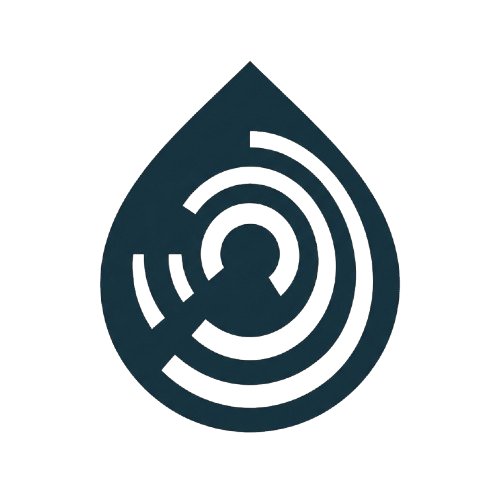

<div align="center">

# iForeSea - AquaSense IoT Hackathon




<a href="https://iforesea-aquasense-iot-hackathon.vercel.app/">
  
</a>

</div>

## Table of Contents

- [Overview](#overview)
  - [Why it matters](#why-it-matters)
  - [How it works](#how-it-works)
  - [Preview](#preview)
  - [Architecture](#architecture)
- [Getting Started](#getting-started)
  - [Prerequisites](#prerequisites)
  - [Installation](#installation)
  - [Usage](#usage)
  - [Dataset](#dataset)
- [About](#about)
  - [License](#license)
  - [Contributors](#contributors)

## Overview

**iForeSea** is an early-warning web platform that predicts the risk of harmful algal blooms (HABs) in the coastal waters of Burgas Bay, Bulgaria, **3-5 days in advance**.

The system ingests water-quality measurements from conventional IoT sensors - water temperature, nitrates (NO₃), phosphates (PO₄), turbidity, and chlorophyll-a - and feeds them into a machine-learning model that estimates the probability of a phytoplankton bloom. Predictions are displayed on an interactive map of Burgas Bay using a simple **green / yellow / red** traffic-light system for three pilot beaches:

- 🟢 **Sarafovo**
- 🟡 **Central Beach Burgas**
- 🔴 **Kraimorie**

### Why it matters

Algal blooms degrade water quality, cause foul odor, reduce transparency, pose health risks, and damage the local tourism economy. Today there is no easy-to-use, real-time early-warning tool for citizens or institutions in the region. AquaSense shifts the response from **reactive** (cleanup after the fact) to **proactive** (forecast and prevent), helping:

- **Citizens & tourists** - pick a safe beach with a glance at a map.
- **Local authorities & water-monitoring agencies** - receive early signals for prevention and response.
- **Eco organizations & tourism operators** - track environmental conditions over time.

### How it works

1. **Sensor data** (simulated IoT readings) is collected at each monitoring point twice a day.
2. The **ML model** analyzes the relationships between temperature, nutrients (N/P), and turbidity, and forecasts the chlorophyll-a trajectory as a bloom indicator.
3. The **FastAPI backend** serves predictions through a REST API.
4. The **Next.js web app** renders the bay map with color-coded risk markers per beach.

### Preview

<!-- later images -->


### Architecture

```
┌────────────────────────────┐
│   IoT / Simulated Sensors  │
│  temp · NO₃ · PO₄ · turb.  │
└─────────────┬──────────────┘
              │ CSV / stream
              ▼
┌────────────────────────────┐
│  data/                     │
│   raw → processed → samples│
└─────────────┬──────────────┘
              │
              ▼
┌────────────────────────────┐
│  ml/  (Python)             │
│  feature engineering +     │
│  bloom-risk model          │
│  (chlorophyll-a forecast)  │
└─────────────┬──────────────┘
              │ model artifact
              ▼
┌────────────────────────────┐
│  api/  (FastAPI)           │
│  /predict · /beaches       │
│  risk = green/yellow/red   │
└─────────────┬──────────────┘
              │ JSON over HTTP
              ▼
┌────────────────────────────┐
│  web/  (Next.js)           │
│  interactive Burgas map    │
│  traffic-light per beach   │
└────────────────────────────┘
```

| Layer    | Folder  | Tech                                                      |
| -------- | ------- | --------------------------------------------------------- |
| Data     | `data/` | CSV (raw, processed, samples) - synthetic dataset for now |
| ML       | `ml/`   | Python 3.11+, pandas, scikit-learn                        |
| Backend  | `api/`  | Python 3.11+, FastAPI, Uvicorn                            |
| Frontend | `web/`  | Next.js 16, TypeScript, Tailwind v4, shadcn/ui            |
| Docs     | `docs/` | Project documentation                                     |

## Getting Started

Follow these steps to set up and run the project locally.

### Prerequisites

Make sure you have the following installed:

- **Node.js** v20 or higher
- **npm** v10 or higher
- **Python** 3.11 or higher
- **pip** (or [uv](https://github.com/astral-sh/uv)) for Python dependencies

### Installation

Clone this repository:

```bash
git clone https://github.com/DIDimov24/iForeSea-AquaSense-IoT-Hackathon.git
cd iForeSea-AquaSense-IoT-Hackathon
```

Install the **frontend** dependencies:

```bash
cd web
npm install
```

Install the **backend** (FastAPI) dependencies. The API imports `bloom_ml` at runtime, so install both packages editable into the same venv:

```bash
cd api
python -m venv .venv
# Windows
.venv\Scripts\activate
# macOS / Linux
# source .venv/bin/activate
pip install -e ../ml -e .
```

Install the **ML** package (used to train / run the bloom model):

```bash
cd ml
python -m venv .venv
# Windows
.venv\Scripts\activate
# macOS / Linux
# source .venv/bin/activate
pip install -e .
```

This installs the `bloom-ml` package (pandas, scikit-learn, joblib; XGBoost optional) and registers the `bloom-train` console script.

### Usage

Start the **backend API** (port 8000):

```bash
cd api
uvicorn api.main:app --reload --port 8000
```

Train the **ML model** (optional - pretrained artifacts already in `ml/models/`):

```bash
cd ml
# venv activated, package installed (see Installation)
bloom-train
# or: python -m bloom_ml.train
```

Reads `data/water_quality_burgas_simulated_2025_2026.csv`. Trains RandomForest baseline + XGBoost (if installed), keeps lower-MAE model. Writes:

- `ml/models/bloom_forecaster.pkl`
- `ml/models/feature_columns.pkl`

API loads these at startup. Re-run `bloom-train` after dataset or feature changes.

Start the **web app** (port 3000):

```bash
cd web
npm run dev
```

Then open your browser at <http://localhost:3000>. The frontend will fetch bloom-risk predictions from the API at <http://localhost:8000>.

### Dataset

The repo ships with a simulated dataset for Burgas Bay at `data/water_quality_burgas_simulated_2025_2026.csv`:

- **Period:** 2025-05-15 → 2026-05-15 (full year)
- **Frequency:** 2 measurements/day (08:00, 16:00)
- **Locations:** Sarafovo, Central Beach Burgas, Kraimorie
- **Rows:** 2196
- **Columns:** timestamp, measurement_session, location_id, location_name_bg, lat/lon, temperature (°C), NO₃ (mg/L), PO₄ (mg/L), turbidity (NTU), chlorophyll-a (µg/L)

See [`data/raw/README.md`](./data/raw/README.md) for full column reference and risk-class thresholds.

The data is synthetic but seasonally structured and correlated, suitable for prototyping, visualization, correlation analysis, and ML experimentation.

## About

### License

This project is licensed under the MIT License - see the [LICENSE](LICENSE) file for details.

### Contributors

- [@Denislav Dimov](https://github.com/DIDimov24)
- [@Altay Yemendzhiev](https://github.com/Altay-Yemendzhiev)
- [@Georgi Georgiev](https://github.com/GAGeorgiev24)
- [@Vsevolod Bolotov](https://github.com/VYBolotov24)
- [@Aleksandar Dyanov](https://github.com/AVDyanov24)
